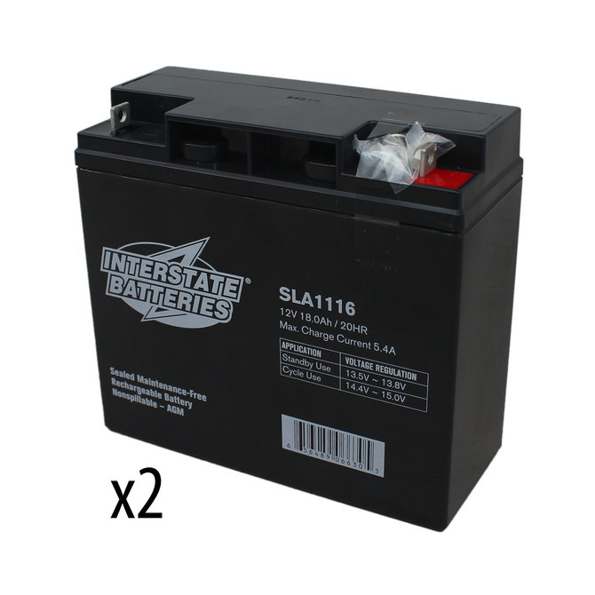

[< back to main menu](index.md)

---

# Hardware
Now, you might be asking, "why should I, a programmer, need to know how many amps a Falcon 500 draws?" The answer is simple: your code interacts *directly* with the hardware. If you want to know that your code is doing what it is supposed to be doing, you first need to understand how the devices you are controlling work. __Electrical is your friend.__ Make friends with some electrical members! They don't bite, I promise (unless, of course, you run a normally 12V battery down to 7V). As a programmer, you will be working closely with Electrical to get the robot ready to run code. Without Electrical, programming can't run their code. Without Programming, the devices Electrical wired can't do anything. You're on a *team*. If every member of Electrical died, you should be able to fill in.

## General Devices (please read in order)
1. [The Battery](#the-battery)
2. The REV Robotics Power Distribution Hub
3. The National Instruments roboRIO
4. The CTR Electronics Pneumatics Control Module
5. The Kauai Labs NavX
6. Controller Area Network
7. Speed Controllers
8. Motors

## Specific Devices
1. The VEX Robotics VictorSP
2. The VEX Robotics Falcon 500
3. The VEX Robotics TalonFX
4. The VEX Robotics VictorSPX
5. The VEX Robotics CANCoder
6. The REV Robotics Brusless Neo
7. The REV Robotics CAN Spark MAX

---

### The Battery


```
*queuing for a qualification match*
Person 1: "is our battery charged"
Person 2: "I don't know"
```

This is AndyMark's am-3062, a 12V Lead Acid battery. For some reason, FIRST has yet to switch to lithium-ion battery power in robotics (sarcasm). While these batteries are called 12V batteries, they really should never be idling below 12V. When you are queuing for a match of any kind, *make sure the battery is at least 12.4V*. You will soon come to realize that a full swerve train and all the other actuators on the robot tend to draw a large current, especially when you're zipping across the field, intaking a ball, spooling up the launcher, and pressurizing the pneumatics at the same time. At the end of the match, the battery could have easily dropped to 12V.

__When measuring the charge on a battery, use a Battery Beak.__ If you don't know what that is, ask an Electrical member right now. The voltage on a charged battery can range anywhere from 12.4V to 13.0V. It's fine.

When the robot is disabled, the Driver Station will display the battery's idle voltage, or the voltage when the robot is simply turned on and powering essential components. When the robot is enabled and many devices are being used (i.e. motors, compressor, limelight, etc..), __the voltage will fluctuate and spike__. The "safe" range of voltage spikes is anything greater than 7V. If the battery drops below 6.8V, the roboRIO will enter brownout protection mode. This means that all power to motors, compressors, etc... will be cut off. This is to ensure that the roboRIO does not lose the power required to stay alive. __If the roboRIO loses power, your robot will be disabled automatically.__ Additionally, if the voltage drops below 6.3V, the robot will be disabled automatically. Hopefully, this won't happen because of brownout protection[^1]. If you start the match with at least 12.3V, you shouldn't ever have brownout protection enabled on you.

---
[< back to top of page](#hardware)

[< back to main menu](index.md)

[^1]: (https://docs.wpilib.org/en/stable/docs/software/roborio-info/roborio-brownouts.html#:~:text=The%20roboRIO%20uses%20a%20staged,the%20battery%20voltage%20dangerously%20low)
